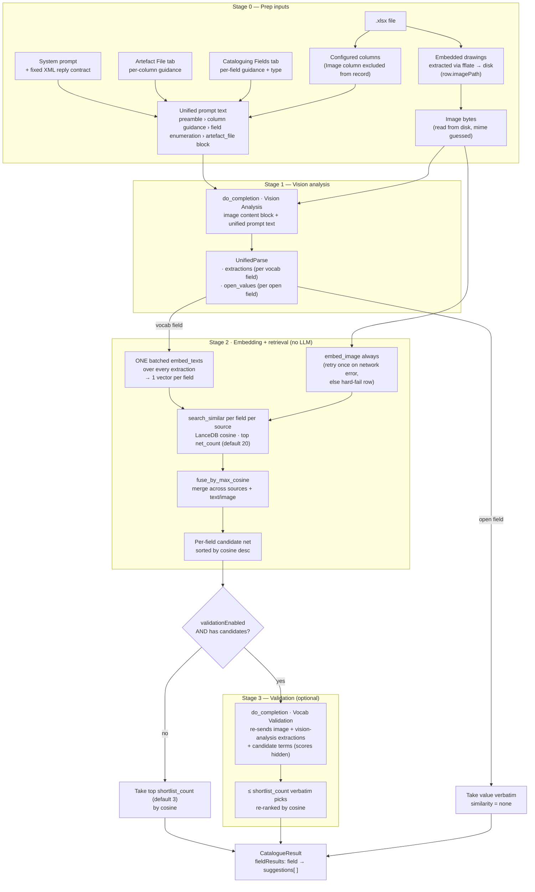

# Artefact Cataloguer

[](LICENSE)
[](https://nodejs.org)
[](https://tauri.app)
[](https://www.rust-lang.org)

**Artefact Cataloguer** is a Tauri 2 desktop app for AI-assisted museum cataloguing — upload an artefact spreadsheet, extract embedded images, run each row through an OpenAI-compatible model for ranked catalogue-field suggestions, review, and export `.xlsx`.


---

## Features

- **AI-assisted field suggestions** — a three-step pipeline (vision LLM → embedding search → optional vision validation) returns per-field picks. Open-ended fields carry a free-text answer; controlled-vocabulary fields carry cosine `similarity`-ranked terms.
- **Similarity bars** — each controlled-vocab suggestion is shown with a coloured similarity bar and percentage so reviewers can weight picks at a glance. (Open-ended fields have no similarity — the answer is taken verbatim.)
- **Controlled vocabularies** — bind one or more term lists (`.csv`/`.xlsx`/`.xls`) to a field; AI output is constrained to allowed terms, validated against the embedding search's candidate net.
- **Configurable retrieval** — set the candidate "net" count (default 20) and the final "shortlist" count (default 3) per vocab field, and toggle validation (the vision-validation backstop) on or off, all in the Vocabulary Lists tab.
- **Embedded-image extraction** — `.xlsx` drawing anchors are mapped to media files and snapped to the nearest data row; images are served via the Tauri asset protocol.
- **Image lightbox** — full-screen viewer with zoom-in/out/reset and a live percentage readout (local `useImageZoom` hook).
- **Run lifecycle** — Pause / Resume / Cancel a batch; per-row Stop (transport-level cancel of the in-flight call — only that row stops, the run continues) and per-row Retry / Retry-all-failed; first error fail-fasts the batch.
- **Review-friendly results** — expandable rows with status dots, searchable field dropdowns, filter + a column-scoped search over results (pick which artefact-file and catalogue columns the search matches), drag-to-reorder vocab/field lists.
- **Multiple AI providers** — configure several providers, mark one active, and run a **Test Connection** per provider (fetches the model list).
- **Settings import/export** — round-trip the settings blob as a zod-validated JSON file.
- **Theme & zoom** — dark mode (default on) and zoom (0.7–1.5), both persisted.
- **`.xlsx` export** — export the **done** rows as a native Excel workbook via the save dialog. Each artefact-file column toggled on (default all) becomes a leading column, followed by the catalogue fields; an image column embeds its extracted bytes per row. Cells are sanitized against formula injection (OWASP guidance).

---

## Quick Start

Pre-built binaries are on the [Releases page](https://github.com/reverie89/artefact-cataloguer/releases).
To run from source:

```bash
git clone https://github.com/reverie89/artefact-cataloguer.git
cd artefact-cataloguer
npm install
npm run tauri:dev     # full app (Rust backend + renderer + window); HMR
# npm run dev         # renderer-only iteration at http://localhost:1420 (no Rust window)
```

---

## How to Use

### Step 1: Upload an artefact spreadsheet

Drag-and-drop one or more `.xlsx` files (or use the file picker). Each file is validated against the configured required columns, with per-file status
(`validating` / `valid` / `invalid`) and missing-column errors surfaced inline. Embedded images are extracted automatically.

### Step 2: Configure an AI provider

An active provider is required before cataloguing — without one, parsing the spreadsheet is blocked with a clear prompt to add one. See **Configuring an AI provider** below.

### Step 3: Run and review

Click **Start** to run the active provider over every row. Results stream in live: each row shows per-field suggestions (controlled-vocab fields ranked by cosine similarity; open-ended fields with the model's free-text answer). For each field, accept an AI pick, choose from its controlled-vocabulary dropdown, or type a value manually. A vocab field with no matching candidate stays empty — the model can only pick from the source's terms. Use the image lightbox to inspect the artefact.

During a run, **Pause** / **Resume** / **Cancel** controls are available. A **processing** row offers **Stop** (cancels just that row's in-flight call — the
rest of the run continues); a **done**/**errored**/**cancelled** row offers **Retry**, and all failed rows can be retried at once via **Retry all failed**.

### Step 4: Export

Click **Export** to save the **done** rows as `.xlsx` via the native save dialog.
Leading columns come from the artefact-file columns toggled on in **Settings → Artefact File** (default all on); the catalogue fields follow. Each field emits its selected value (or the top AI pick if none was chosen); an image column embeds its extracted bytes per row.

### Configuring an AI provider

AI providers are configured **inside the app** under
**Settings → Model Providers**:

1. Open the app and go to **Settings → Model Providers**.
2. Add a provider with a **Base URL**, **API key**, and **Model**.
3. Each provider declares its API family — one of:
   - `openai` (the default; any OpenAI-compatible `/chat/completions` endpoint)
   - `anthropic` (the native Anthropic API — `x-api-key` auth, `/v1/messages`)
   - `gemini` (the Google Gemini API — Interactions API: `/v1beta/interactions` + `/v1beta/models`)

   This drives both the auth scheme and the endpoint paths.
4. Mark one provider as **active** to route catalogue-field requests through it.

Provider config (base URL, model, etc.) is persisted to the settings store next to the binary via the Rust `load_state` / `save_state` commands (no `localStorage`). **API keys are never written to `settings.json`** — on save they are moved to the OS keychain (Windows Credential Manager / macOS Keychain / Linux secret service) and scrubbed from the file; on load they are reattached from the keychain. A plaintext key found in an older or shared `settings.json` is migrated to the keychain automatically on the first load. Keys still reach only your configured endpoint, never the renderer. Cataloguing
requires a real uploaded spreadsheet and a live, active provider — there is no bundled demo data or fallback.

---

## Requirements

- **Node ≥ 26** (see `.nvmrc`)
- **Rust** toolchain via [rustup](https://rustup.rs)
- **Windows SDK / MSVC Build Tools** (the native TLS stack compiles C; run
  builds from an MSVC environment — see `scripts/`).
- Rust targets:
  ```sh
  rustup target add aarch64-pc-windows-msvc x86_64-pc-windows-msvc
  ```

---

## Development

| Command | Description |
|---|---|
| `npm run dev` | vite dev server — renderer only (http://localhost:1420) |
| `npm run tauri:dev` | tauri dev — full app (Rust + renderer + window), HMR |
| `npm run build` | `tsc -b && vite build` — renderer → `dist/` (compile only, no installer) |
| `npm test` | vitest unit tests (renderer) |
| `npm run test:watch` | vitest in watch mode |
| `npm run lint` | eslint (`eslint .`) |
| `npm run build:win-all` | NSIS installers — arm64 + x86_64 |
| `cargo test` *(from `src-tauri/`)* | Rust unit tests |

---

## Build (Windows installers — arm64 + x86_64)

```sh
# Both targets, MSVC env auto-loaded:
powershell -ExecutionPolicy Bypass -File scripts/build-windows.ps1

# Or one target:
powershell -File scripts/build-windows.ps1 -Arm64
powershell -File scripts/build-windows.ps1 -X64
```

`build:win-all` / `build:win-arm64` / `build:win-x64` are the underlying
per-target `tauri build` scripts the wrapper invokes. Output:

```
src-tauri/target/<triple>/release/bundle/nsis/Artefact Cataloguer_*-setup.exe
```

---

## Architecture

Two layers with a shared contract: a **Rust backend** (`src-tauri/`) and a **React renderer** (`src/`), connected by Tauri commands + events. AI calls run in Rust so API keys never reach the renderer and CORS is a non-issue.

```text
src/
  main.tsx / App.tsx   entry + root component
  app/                 types, schema, defaults, state (reducer), actions, drafts, styles
  components/
    common/            generic, domain-free composites (ConfirmDialog, ImageLightbox)
    main/              main-screen feature components (TopBar, MainScreen,
                       UploadPanel, ResultsPanel, ResultRow, LogsViewer)
    settings/          Cataloguing Fields, Vocabulary Lists, Model Providers
                       (Vision + Embedding sub-sections), Artefact File, About
    ui/                shadcn/ui primitives (button, dialog, select, sheet, …)
  hooks/               useDropZone, useImageZoom, useConfirmDelete (local — no zoom library)
  lib/                 store.ts (Rust bridge), spreadsheet.ts (ExcelJS),
                       images.ts (fflate zip+drawings), ai.ts, logs.ts, utils.ts
  styles/globals.css   indigo OKLCH tokens (Tailwind v4 @theme)
src-tauri/src/
  lib.rs               command registry + load_state / save_state
  settings.rs          settings.json persistence (keys excepted — see secrets.rs)
  secrets.rs           OS-keychain storage + scrub/rehydrate on save/load
  images.rs            write extracted image bytes, asset-protocol serving
  ai.rs                three-step XML pipeline (vision analysis/extraction +
                       embeddings.rs per-field search + validation)
```

- **XLSX parsing & export** uses ExcelJS in the frontend for both reading cell data (real column validation against configured required columns) and writing the exported workbook; image extraction is separate (see below).
- **Image extraction** unpacks the `.xlsx` zip (`fflate`), maps `xl/drawings` anchors → `xl/media` files → data rows, then hands bytes to Rust to write beside the binary and serve via the asset protocol.
- **AI calls** run in Rust (`reqwest`, `rustls-tls`) against the configured provider's API (`openai`, `anthropic`, or `gemini`).

#### Cataloguing pipeline

Each artefact row is catalogued through a **three-step pipeline** using XML for both the request payload and the response, so the model sees one consistent format:



- **Vision analysis.** Observes the artefact and answers every field in one XML response: a rich `<image_description>`, one `<extraction field="…">` per controlled-vocab field (field-specific text used to search that field's own source), and one `<open_field field="…">` per open-ended field (the free-text answer, used directly). Built from the **Artefact File tab**'s single Override-gated "System Prompt" (persona + output-format preamble); the dynamic per-field XML enumeration and the `<artefact_file>` record are Rust-appended at runtime. The artefact record is delivered as XML, not JSON, for format consistency.
- **Embedding step (per-field).** Each vocab field's **own** `<extraction>` is embedded in one batched call, and the artefact image is embedded alongside it (embedding providers must be multimodal — text + image; an image-embed failure hard-fails the row after one retry on a network error). The per-field vector and the image vector are each searched against the synced LanceDB tables; the best candidates across sources/modalities are fused by **max cosine similarity**, and the top `net count` (default 20, configurable) are kept. Per-field embedding (rather than one global description vector) is the primary fix for mis-matches like "u-shape" returned for a circular object. Empty/missing extraction → no candidates for that field + a warning.
- **Validation (optional, toggleable).** One batched call, threaded and trimmed onto vision analysis (image re-sent). Each vocab field's extracted text and its ≤net-count candidate **terms** (pure strings — no cosine, no thesaurus) are presented; the vision model picks the top `shortlist count` (default 3, configurable) **verbatim from the candidate set** (a hallucination guard in Rust drops any term not in the net). If none fit, the field stays **empty + warning** — a controlled-vocab field can only ever receive values that exist in its source. When validation is **off**, the cosine top-`shortlist count` is used directly.
- **Similarity.** Controlled-vocab picks carry `similarity = cosine` (grounded in vector distance, not the model's self-reported guess); open-ended fields have no similarity. When validation overrides a poor embedding match, that pick's similarity stays low — an honest signal that the vision model overrode a weak embedding.
- **No thesaurus tiebreak.** Candidate ranking is the embedding's alone; final selection is validation's. The `Thesaurus` vocab column still feeds embedding text at sync time (useful for embedding quality) but is never surfaced to the LLM.
- **Optional prompts.** An empty per-column or per-field prompt is **omitted** from the prompt rather than emitted as a blank line.
- **Cancel/Stop** drops the in-flight `reqwest` future at any point (real socket close), resolving the call with a cancel sentinel the renderer distinguishes from a genuine failure.

The unified System Prompt is editable (Override-gated) and previewable in Settings → Artefact File; per-field prompts live in Settings → Cataloguing Fields. The exact vision-analysis prompt is assembled by the same Rust builder the live call uses, so the preview can't drift.

##### Decision: resolving controlled-vocabulary fields

Three routes were considered for how vocab fields are resolved:

1. **Pure embedding, no LLM** — one global description vector → cosine search → top-N. Rejected: a global vector isn't field-specific, which produced poor matches (e.g. "u-shape" for a circular object).
2. **Per-field embedding + optional LLM validation** *(selected)* — each vocab field's own extraction is embedded (the primary fix), then an optional, toggleable vision LLM call (validation) rejects embedding false-positives using the image. The LLM only picks from the candidate net (no hallucination); similarity stays cosine-grounded. When validation is off, cosine top-N is used directly.
3. **LLM self-reported confidence** — let validation both pick and score confidence. Rejected: model self-reported confidence is poorly calibrated; cosine is a grounded, measurable signal.

The selected route is **(2)**: it fixes the root cause of poor matches (per-field embedding) while keeping an optional vision backstop, and grounds similarity in cosine.

**Stack:** Tauri 2 (Rust backend + WebView2 frontend) · React 19 + TypeScript · shadcn/ui (new-york) + Tailwind CSS v4 + Radix · ExcelJS · `fflate` · `zod` · `@dnd-kit` · `reqwest` + `tokio` + `serde` (Rust) · `lucide-react` icons.

**Runtime files:** settings live in `<exe_dir>/settings.json` (one blob: settings, dark-mode flag, zoom) read/written via the Rust `load_state` / `save_state` commands — no `tauri-plugin-store`, no `localStorage`. **API keys are stored in the OS keychain**, not in `settings.json`: `save_state` moves them to the keychain and scrubs the file; `load_state` reattaches them (migrating any plaintext key from an older/shared file on first load). This means a `settings.json` shared between machines carries provider config but **not** their keys — recipients must re-enter keys. Extracted images unpack from the `.xlsx` zip into `<exe_dir>/tmp/artefact-cataloguer/<session>/…`; the whole subtree is wiped on app **start** and on app **quit**.

### Code conventions

The codebase follows **KISS · DRY · SOLID · YAGNI**. The full ruleset — including file-placement guidance, the shared-helper policy, design-token usage, the backend contract, and icon usage — lives in [`AGENTS.md`](AGENTS.md). Read it before contributing.

### Security hardening

The renderer is treated as untrusted throughout (per AGENTS.md). Notable controls:

- **API keys** live in the **OS keychain**, never in `settings.json` (see Runtime files above).
- **Path traversal** is blocked on every Rust command that takes a path/id from the renderer — `validate_path_segment` (rejects `..`, separators, drive letters; requires `file_name() == raw`) and `validate_scratch_path` (canonicalize + prefix-check).
- **Image-path reads** in `catalogue_artefact` are confined to the scratch dir; the renderer cannot read arbitrary files.
- **CSP** locks `connect-src` to `'self'` + the Tauri IPC bridge, so the renderer cannot make direct outbound network requests — all egress goes through Rust.
- **Export** is sanitized against formula injection: cells beginning with `= + - @` or TAB/CR are prefixed with `'` so spreadsheet apps treat them as text (OWASP guidance).
- **Prompt construction** escapes user-controlled text in XML contexts (`xml_escape_attr` for attribute values, `xml_escape_text` for element content) so a field/column name containing `"` can't break the prompt's structure. (Prompt-injection itself cannot be fully prevented by escaping — the LLM can still be steered by data it reads — but structural corruption is blocked.)

**Known gaps (not yet hardened):** the configured `baseUrl` is not validated against SSRF (a malicious or imported `settings.json` could repoint the app at an attacker server and exfiltrate the key); open-ended field values returned by the LLM have no allowlist (a hijacked open field can carry arbitrary text into the export, though the export sanitization above neutralizes formula injection).

---

## License

This project is licensed under the GNU General Public License v3.0 (`GPL-3.0-only`). See [LICENSE](LICENSE).
